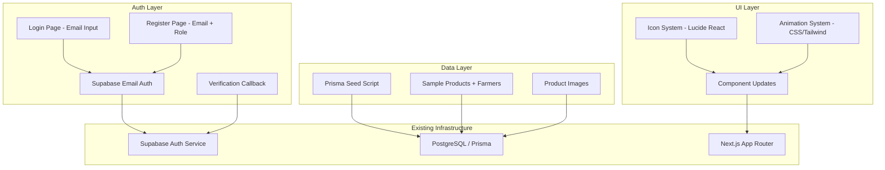
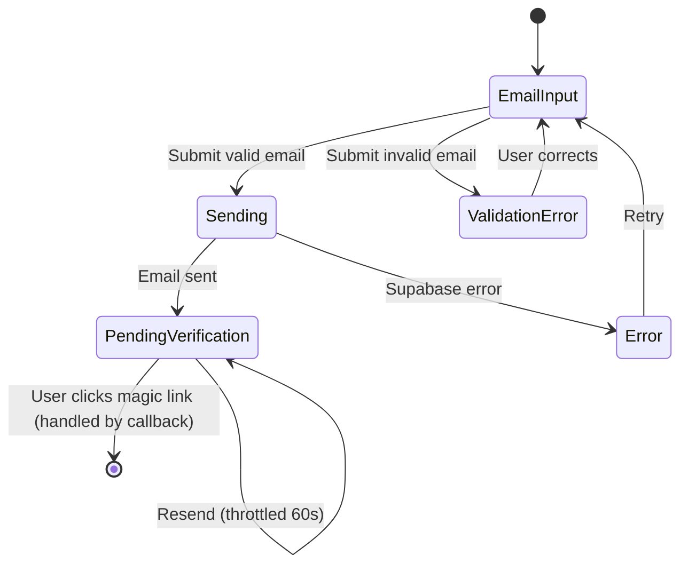
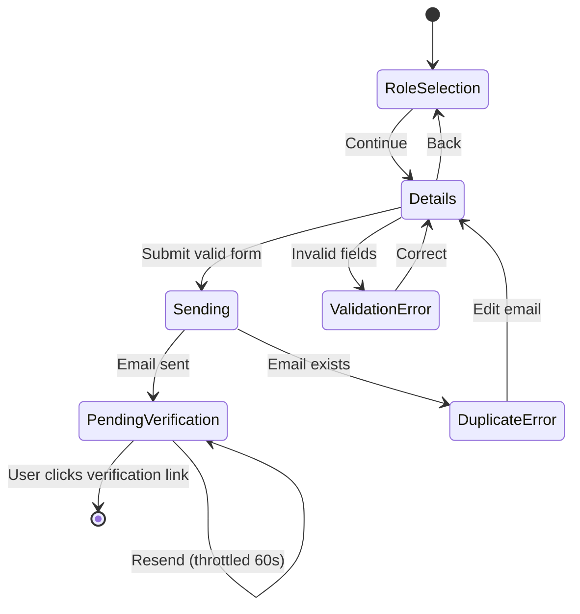

# Design Document: UI/UX Improvements

## Overview

This design covers four coordinated improvements to the AgriPulse marketplace application: replacing emoji characters with Lucide React SVG icons for visual consistency, populating the marketplace with realistic sample product data via Prisma seeding, replacing the phone/OTP authentication flow with Supabase email magic links, and adding CSS animations and micro-interactions for a premium feel.

The changes are largely independent in implementation but share a common goal of elevating the application from a functional prototype to a polished, professional product. Each improvement touches different layers of the stack — UI components, database seeding, authentication logic, and CSS/animation — allowing parallel development.

## Architecture



### Key Architectural Decisions

1. **Icon system uses direct Lucide imports** rather than a custom icon wrapper. Rationale: The project already imports Lucide icons in components like `bottom-nav.tsx` and `product-card.tsx`. Maintaining the same pattern avoids unnecessary abstraction.

2. **Seed script extends the existing `prisma/seed.ts`** rather than creating a separate file. Rationale: The project already has a seed script with category data. Extending it keeps seeding logic consolidated and maintains the existing `npm run db:seed` command.

3. **Email auth uses Supabase's built-in magic link flow** (`signInWithOtp` with email) rather than custom email sending. Rationale: Supabase handles email delivery, link generation, and token verification. This minimizes custom code and security surface area.

4. **Animations use Tailwind CSS utility classes and `@keyframes` in globals.css** rather than a JS animation library (e.g., Framer Motion). Rationale: The project uses Tailwind exclusively for styling, animations are simple (fades, scales, transitions), and CSS-only animations perform better and respect `prefers-reduced-motion` natively.

## Components and Interfaces

### Icon System Changes

**EmptyState Component (updated interface):**

```typescript
// Before
interface EmptyStateProps {
  icon: string; // emoji string
  title: string;
  description: string;
  actionLabel?: string;
  actionHref?: string;
  onAction?: () => void;
}

// After
interface EmptyStateProps {
  icon: React.ComponentType<{ className?: string }>;
  title: string;
  description: string;
  actionLabel?: string;
  actionHref?: string;
  onAction?: () => void;
}
```

**Icon mapping for categories:**

```typescript
import {
  Leaf, Apple, Wheat, Carrot, Drumstick,
  Fish, Flower2, Egg,
} from "lucide-react";

const CATEGORY_ICONS: Record<string, React.ComponentType<{ className?: string }>> = {
  vegetables: Leaf,
  fruits: Apple,
  "rice-grains": Wheat,
  "root-crops": Carrot,
  "poultry-meat": Drumstick,
  seafood: Fish,
  "herbs-spices": Flower2,
  "dairy-eggs": Egg,
};
```

**Icon mapping for roles (registration page):**

```typescript
import { ShoppingCart, Wheat, UtensilsCrossed, Store } from "lucide-react";

const ROLES = [
  { value: "consumer", label: "Buyer", icon: ShoppingCart, desc: "Buy fresh produce" },
  { value: "farmer", label: "Farmer", icon: Wheat, desc: "Sell your harvest" },
  { value: "restaurant", label: "Restaurant", icon: UtensilsCrossed, desc: "Bulk ordering" },
  { value: "grocery", label: "Grocery", icon: Store, desc: "Wholesale supply" },
];
```

**Brand icon:** Replace 🌱 with `Sprout` from lucide-react at `h-7 w-7`.

### Authentication Flow Components

**Login Page State Machine:**



**Registration Page State Machine:**



**Email verification callback route (`/auth/callback`):**

```typescript
// src/app/auth/callback/route.ts
import { createClient } from "@/lib/supabase/server";
import { NextResponse } from "next/server";

export async function GET(request: Request) {
  const { searchParams } = new URL(request.url);
  const code = searchParams.get("code");

  if (code) {
    const supabase = await createClient();
    const { data, error } = await supabase.auth.exchangeCodeForSession(code);

    if (!error && data.user) {
      const role = data.user.user_metadata?.role;
      const redirect = role === "farmer" ? "/dashboard" : "/marketplace";
      return NextResponse.redirect(new URL(redirect, request.url));
    }
  }

  // Expired or invalid link
  return NextResponse.redirect(new URL("/auth/verify-expired", request.url));
}
```

### Seed Script Structure

```typescript
// Extended prisma/seed.ts
async function seedProducts() {
  // 1. Create/upsert farmer users (2-3 sample farmers)
  // 2. Create/upsert farmer profiles with farm details
  // 3. Create/upsert 12+ products across 6+ categories
  // 4. Create/upsert product images for each product
  // All operations use upsert for idempotency
}
```

**Sample farmers data structure:**

```typescript
const SAMPLE_FARMERS = [
  {
    email: "farmer.maria@example.com",
    firstName: "Maria",
    lastName: "Santos",
    farm: {
      farmName: "Santos Organic Farm",
      province: "Benguet",
      municipality: "La Trinidad",
      barangay: "Balili",
      farmSizeHectares: 2.5,
      primaryCrops: ["lettuce", "cabbage", "carrots"],
      farmingExperienceYears: 12,
    },
  },
  // ... 2 more farmers
];
```

### Animation System

**New CSS keyframes in globals.css:**

```css
@keyframes shimmer {
  0% { background-position: -200% 0; }
  100% { background-position: 200% 0; }
}

@keyframes fade-in-up {
  from {
    opacity: 0;
    transform: translateY(8px);
  }
  to {
    opacity: 1;
    transform: translateY(0);
  }
}

@media (prefers-reduced-motion: reduce) {
  *, *::before, *::after {
    animation-duration: 0.01ms !important;
    animation-iteration-count: 1 !important;
    transition-duration: 0.01ms !important;
  }
}
```

**Tailwind utility classes for animations:**

```css
@layer utilities {
  .animate-shimmer {
    animation: shimmer 1500ms linear infinite;
    background-size: 200% 100%;
  }

  .animate-fade-in-up {
    animation: fade-in-up 300ms ease-out forwards;
  }
}
```

## Data Models

No schema changes are required. The feature uses existing Prisma models:

- **User** — sample farmer users for seed data
- **Farmer** — farm profiles associated with sample users
- **Category** — already seeded, used as foreign keys for products
- **Product** — 12+ sample products to populate marketplace
- **ProductImage** — at least one image per product

### Seed Data Constraints

| Field | Constraint |
|-------|-----------|
| Product.name | 1–100 characters, Filipino product names |
| Product.description | 10–500 characters |
| Product.price | ₱5.00–₱10,000.00 |
| Product.unit | kg, piece, bundle, sack, or crate |
| Product.availableQuantity | 1–9,999 |
| Product.minimumOrder | ≥1 and ≤ availableQuantity |
| Product.isActive | true |
| Product.deletedAt | null |
| Farmer.user.isActive | true |
| ProductImage.imageUrl | Valid URL returning HTTP 200 |

### Sample Product Images

The seed script will use publicly available placeholder images from Unsplash or a similar CDN that returns agricultural product images. URLs will be hardcoded in the seed data to ensure consistent HTTP 200 responses.

## Correctness Properties

*A property is a characteristic or behavior that should hold true across all valid executions of a system — essentially, a formal statement about what the system should do. Properties serve as the bridge between human-readable specifications and machine-verifiable correctness guarantees.*

### Property 1: Seed data field constraints

*For any* product created by the seed script, the product name SHALL be between 1 and 100 characters, the description SHALL be between 10 and 500 characters, the price SHALL be between 5.00 and 10,000.00, the unit SHALL be one of (kg, piece, bundle, sack, crate), the availableQuantity SHALL be between 1 and 9,999, and the minimumOrder SHALL be greater than or equal to 1 and less than or equal to the availableQuantity.

**Validates: Requirements 2.3**

### Property 2: Seed data relational integrity

*For any* product created by the seed script, the product SHALL reference a farmer whose associated user has isActive set to true, a non-empty farmName, and a non-empty province, AND the product SHALL have at least one associated ProductImage record with a non-empty imageUrl.

**Validates: Requirements 2.4, 2.5**

### Property 3: Category filtering correctness

*For any* list of products and any selected category ID, filtering the products by that category SHALL return only products whose categoryId matches the selected category. When no category is selected (null), filtering SHALL return all products unchanged.

**Validates: Requirements 2.6**

### Property 4: Seed idempotency

*For any* number of consecutive executions of the seed script (N ≥ 1), the resulting product count and product data in the database SHALL be identical to the result after a single execution.

**Validates: Requirements 2.7**

### Property 5: Email validation rejection

*For any* string that does not conform to standard email format (missing @ symbol, missing domain, missing TLD, exceeding 255 characters, or containing invalid characters), the login and registration forms SHALL reject it with a validation error and SHALL NOT attempt authentication.

**Validates: Requirements 3.3**

### Property 6: Role-based redirect after verification

*For any* verified user, the auth callback SHALL redirect to /marketplace for consumer, restaurant, and grocery roles, and to /dashboard for the farmer role.

**Validates: Requirements 3.6**

## Error Handling

### Authentication Errors

| Error Condition | User-Facing Behavior |
|----------------|---------------------|
| Invalid email format | Inline validation error below email field |
| Email already registered | Toast/inline error: "This email is already registered" |
| Supabase service error | Toast error: "Something went wrong. Please try again." |
| Expired verification link | Redirect to `/auth/verify-expired` with resend option |
| Rate limit on resend | Disable resend button for 60 seconds with countdown |
| Network failure | Toast error with retry suggestion |

### Seed Script Errors

| Error Condition | Behavior |
|----------------|---------|
| Database connection failure | Log error, exit code 1, no partial data |
| Foreign key constraint violation | Transaction rollback, log error, exit code 1 |
| Duplicate key (non-upsert) | Handled by upsert — no error |
| Invalid image URL at seed time | Log warning but continue (URL validation is advisory) |

### UI/Animation Errors

| Error Condition | Behavior |
|----------------|---------|
| Missing Lucide icon import | Build-time TypeScript error (caught during development) |
| prefers-reduced-motion active | All animations disabled, instant state changes |
| Image load failure (product cards) | Fallback to `/placeholder-product.png` via Next.js Image |

## Testing Strategy

### Unit Tests (Example-Based)

- **Icon replacement**: Verify each component renders the correct Lucide icon at the correct size tier
- **EmptyState interface**: Verify the updated component accepts and renders a React component icon prop
- **Login page**: Verify email input renders, phone input does not, magic link flow triggers correctly
- **Registration page**: Verify all fields render, role icons are Lucide components, form submission calls Supabase
- **Auth callback**: Verify role-based redirect logic for all four roles
- **Animation classes**: Verify product cards receive fade-in-up animation classes, bottom nav has transition indicator
- **Reduced motion**: Verify CSS contains prefers-reduced-motion media query

### Property-Based Tests

Property-based testing applies to this feature for the data validation and filtering logic:

- **Library**: [fast-check](https://github.com/dubzzz/fast-check) (TypeScript PBT library)
- **Minimum iterations**: 100 per property
- **Tag format**: `Feature: ui-ux-improvements, Property {N}: {description}`

Properties to implement:
1. Seed data field constraints — generate random products, verify all constraints hold
2. Seed data relational integrity — verify farmer/image associations for all seeded products
3. Category filtering — generate random product lists and category selections, verify filter correctness
4. Seed idempotency — run seed multiple times, verify identical results
5. Email validation — generate random invalid/valid email strings, verify acceptance/rejection
6. Role-based redirect — generate random roles, verify correct redirect destination

### Integration Tests

- **Marketplace page**: Seed database, render page, verify product cards appear (not empty state)
- **Auth flow end-to-end**: Mock Supabase, test full login and registration flows
- **Seed script execution**: Run `npm run db:seed` against test database, verify expected records

### Smoke Tests

- **Seed output count**: After seeding, verify ≥ 12 products across ≥ 6 categories
- **CSS animation keyframes**: Verify globals.css contains required `@keyframes` definitions
